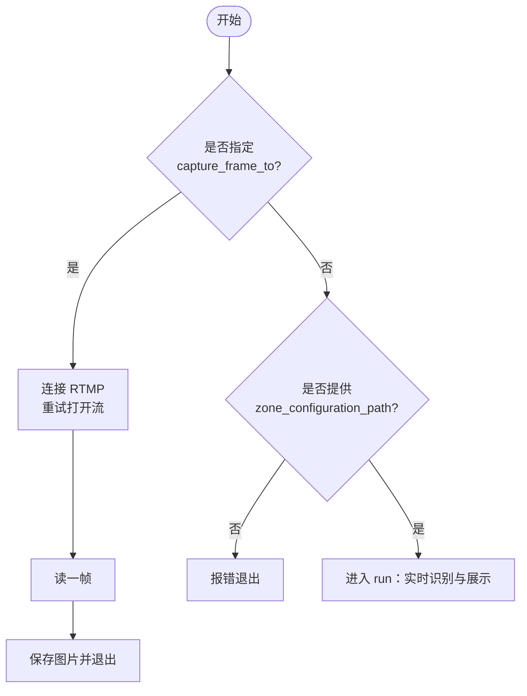
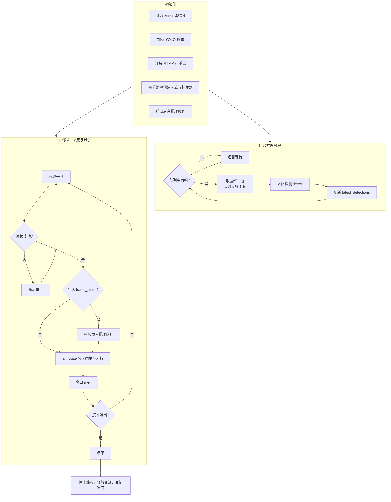
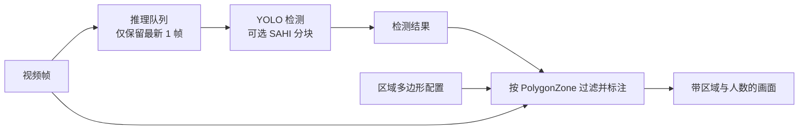

# 拉流人流识别流程图（RTMP）

对应脚本：`rtmp_stream.py`（复用 `ultralytics_example.py` 中的检测与标注逻辑）。

在 VS Code、Cursor、GitHub 等支持 [Mermaid](https://mermaid.js.org/) 的预览中打开本文件即可渲染流程图。

---

## 1. 入口：两种使用方式

---

## 2. 实时拉流（`run`）主流程

---

## 3. 检测与标注的数据流

---

## 说明摘要

| 环节 | 作用 |
|------|------|
| 推理队列 `deque(maxlen=1)` | 只处理最新帧，避免推理积压导致延迟越来越大 |
| `frame_stride` | 每 N 帧送检一次，降低算力；中间帧沿用上次检测结果 |
| 双线程 | 主线程负责读流与显示，推理线程负责 `detect`，减少卡顿感 |
| 断流重连 | `read` 失败时按配置重试打开流 |
